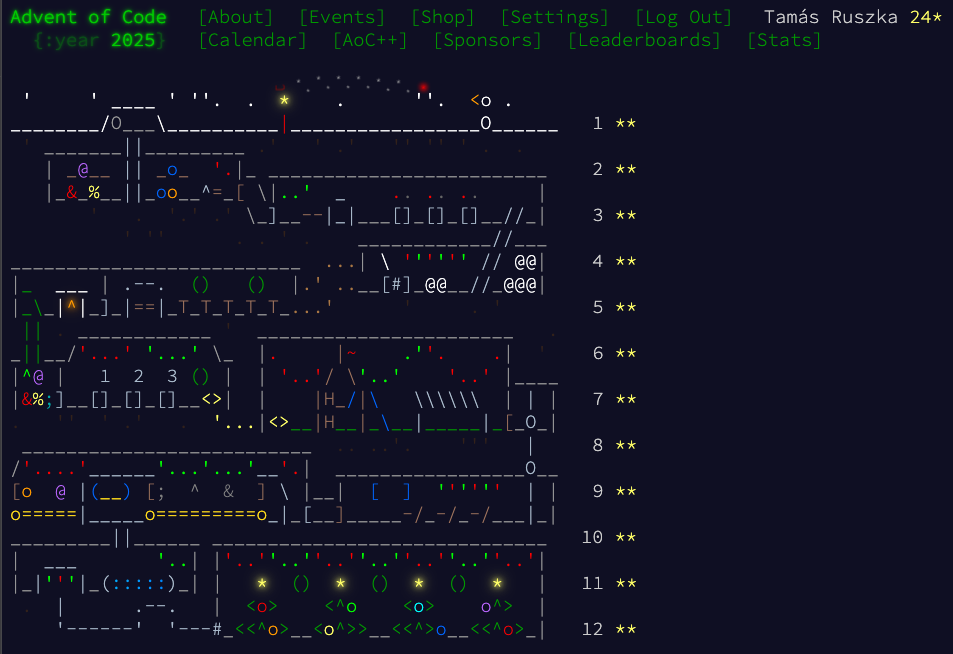

# AdventOfCode-2025

Doing Advent of Code 2025 in typescript, but only using LLM to generate the solutions!

I'll use VS code's built in AI agents to manage the task. I'll try with free models, but if it's not working, I have to switch to some of the paid models.

## Setup

```bash
npm i
npm run start
```

## Result

